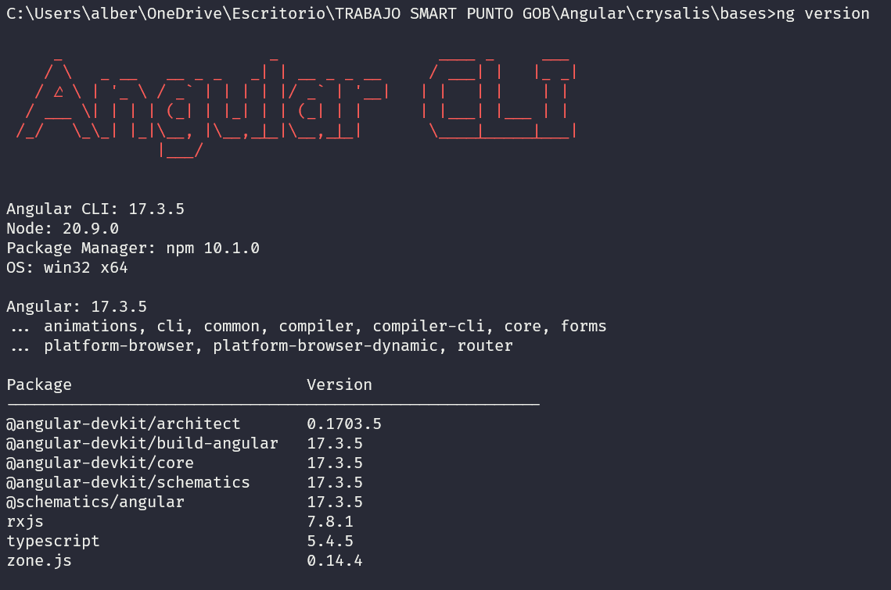

## EditorConfig for VS
Es una extensión que nos permite sobrescribir valores por defecto en nuestro editor de código.
Cuando visual studio code encuentra un archivo .editorconfig basicamente establece esas configuraciones
por defecto para ese proyecto. Veasé en el .editorconfig en la carpeta src.

## Angular.json
Es un archivo que le decimos a Angular ciertas configuraciones para la ejecución de nuestra aplicación.
Como cual es el build, directorio, archivo que se usará para la ejecución de nuestra aplicación, cual es
el archivo index.html, donde estará el archivo principal, el main en javascript, cual son los archivos de
configuración de nuestra aplicación, cuales son los asets, estilos globales de nuestra aplicación.

## Package-lock.json
Es un archivo que no se tocará manualmente, y solamente se manipulará cuando se haga comandos de instalación o remover 
dependencias en el package.json.

## Package.json
Es un archivo propio de node, este proyecto de angular esta contruido sobre node por eso instalamos node.js
Aquí dice la versión, cuales son los scripts, se pueden agregar más script y convinarlos.
Private es un paquete privado. 
Dependencies son paquetes que son requeridos para crear la aplicación de producción.
Cuando usamos ng-build va a tomar todas la dependencias y quitará todo lo que no necesite. 
Quitará la comunicación con el app.server y quitará cosas que no se van utilizar.
El forms viene con este proyecto al momento de crear la aplicación.
en el devDepencias son solamente herramientas de desarrollo.
# Extensiones útiles para VS CODE
1. Bookmarks -> "Marca las lineas y saltos y mucho mas"
2. Bracket Pair Color DLW

3. EditorConfig for VS Code

4. Error Lens

5. Git Graph

6. Live Share

7. Material Icon Theme

8. Paste JSON as Code (Refresh)

10. Thunder Client

11. WLS

12. JavaScript and TypeScript Nighly

# Comandos para creación de componentes en Angular
-`ng g component [name]`: 
  Genera un nuevo componente en el [name], que peude ser también 
  [paht/name]
  Ejemplo: ng g component productos/producto

# PRE-REQUISITOS 
## INSTALACIÓN DE NODE.JS v20.9.0
1. Descargar nvm (Node Version Manager) desde este link, en el apartado de los `Assets`:
[nvm](https://github.com/coreybutler/nvm-windows/releases)

2. Descomprimimos carpeta.

3. Ejecutamos el `nvm-setup.exe`

4. Damos siguiente a todo por defecto. No hay problema por que esta versión ya tiene un instalador para actualizar.

5. Abrimos la terminal y Ejecutar como administrador.

6. Ejecutamos el siguiente comando: `nvm`. Este mostrará la versión en que esta corriendo y que se puede usar.
   NOTA: Si no aparece, vuelve intentarlo

7. Instalamos Node v20.9.0 con el siguiente comando: `nvm install 20.9.0` 

8. Cerramos terminal, volvemos abrir el cmd y Ejecutar como Administtrador.

9. Ingresamos el siguiente comando:` node -v` y debe aparecer la versión de Node.js. Caso contrario vuelve al paso 1.

## INSTALACIÓN DE ANGULAR v17.3.5
1. Abrir teminal y Ejecutar como Administrador.

2. Ingresar el siguiente comando: `npm install -g @angular/cli@17.3.5` y lo ejecutamos.

3. Cerramos terminal y volvemos a abrirlo y Ejecutarlo como Administrador.

4. Ingresamos el siguiente comando: `ng version` y debe aparecer algo como esto:

# EJECUTAR APLICACIÓN 

1. Abrir VS Code en donde se encuentra ubicado el proyecto.

2. Abrimos terminal ya sea de Windows o de VS Code.

3. Ejecutamos el siguiente comando: `npm i`

4. Se instalarán los `node_modules` de esta aplicación.

5. Luego podemos correr nuestra aplicación con el siguiente comando: `ng serve -o`

6. Y solo se desplegará la aplicación.

# Extension.json
Usualmente en esta extensión se pueden añadir paquetes recomendados y le recomiende un set de aplicaciones

# Node_modules
El .gitignore no sube esta carpeta al git. Todos esos node_modules se construyen cuando ejecuta el npm i.
Ya que este comando reconstruye los node_modules.

# Directivas Incluidas en Angular
Las siguientes directivas vienen incluidas dentro dle módulo `"CommonModule"` de `@angular/common`
1. `*ngIf`: Remueve o crea una parte del DOM basado en la expresión "showSection".
2. `*ngFor`: Convierte el `<li>` en un template, y lo usa para duplicarlo basado en la cantidad de elementos dentro de la lista.
3. `ngSwitch`: Condicionalmente cambia el contendio del `
` por el template que cumpla la condición.

# Folder app. Estructura común al generar un nuevo componente
En este folder es donde se construira la lógica de negocio. 
Aquí se ubicarán los servicios y modulos.
Y son los mismos archivos que la estan afuera de la raiz.
  - app.component.css => Archivo .css
  - app.component.html => Archivo .html
  - app.component.spec.ts => Archivo que me ayudarán a ser el Testing.
  - app.component.ts => Este archivo de typescript que tiene unos decoradores y referencias al html y al css.
   que por defecto tiene un decorador y es una simple clase
  y aquí se define el app-root, y 
  - app.module.ts => Este es un modulo principal e importante. Hay cosas en las cuales hay que tener cuidado a
  la hora de utilizarlo. 

# app.module.ts
Un módulo es una simple clase que tiene un decorador y en si mismo es un agrupador.
Osea que encapsula una funcionalidad de tal manera que si se necesita compartirla
le facilitará y protegerá del mundo exterior.
Son contenedores para realizar la cohesión de código que tiene un funcionamiento en común, este funcionamiento en común puede ser un flujo de trabajo o un conjunto de capacidades o código 
dedicado a un dominio de aplicación

# Folder Assets
Son recursos estaticos que nosotros vamos a subir.

# .gitkeep
Este archivo indica que el folder es importante y lo va a mantener

# Bases

This project was generated with [Angular CLI](https://github.com/angular/angular-cli) version 17.3.5.

## Development server

Run `ng serve` for a dev server. Navigate to `http://localhost:4200/`. The application will automatically reload if you change any of the source files.

## Code scaffolding

Run `ng generate component component-name` to generate a new component. You can also use `ng generate directive|pipe|service|class|guard|interface|enum|module`.

## Build

Run `ng build` to build the project. The build artifacts will be stored in the `dist/` directory.

## Running unit tests

Run `ng test` to execute the unit tests via [Karma](https://karma-runner.github.io).

## Running end-to-end tests

Run `ng e2e` to execute the end-to-end tests via a platform of your choice. To use this command, you need to first add a package that implements end-to-end testing capabilities.

## Further help

To get more help on the Angular CLI use `ng help` or go check out the [Angular CLI Overview and Command Reference](https://angular.io/cli) page.

